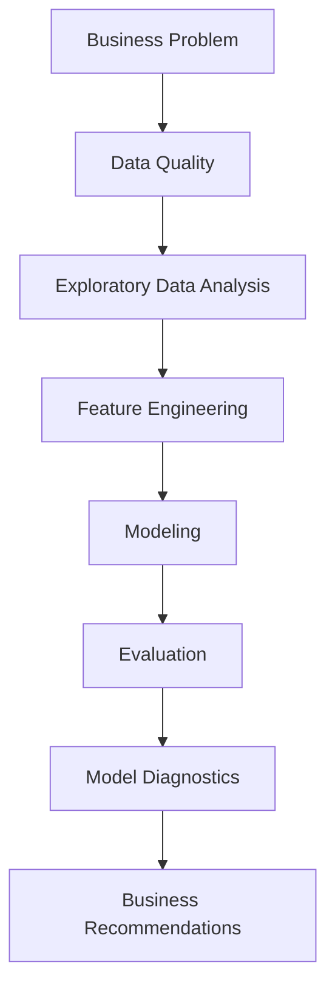
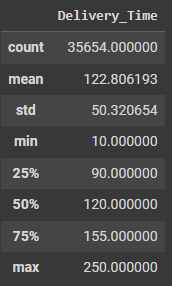
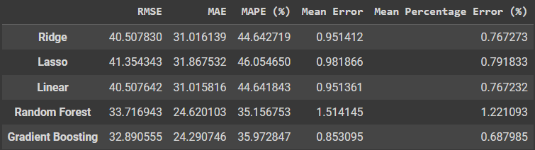
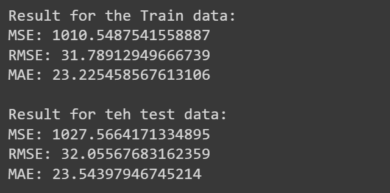

# Amazon E-commerce Delivery Time Prediction Project 🚚

Welcome to the **Amazon E-commerce Delivery Time Prediction Project**!

This project aims to help e-commerce platforms like Amazon accurately predict delivery times based on various factors, ensuring timely deliveries and improving customer satisfaction.

## Objective

To assist e-commerce companies in accurately predicting delivery times based on order and delivery-related features, ensuring an efficient and reliable logistics process.

## Goals

Create a machine learning regression model to predict the delivery time for orders, helping the company improve logistics management and customer satisfaction.

## Dataset

The dataset used for this project can be found on Kaggle: [Amazon Delivery Dataset](https://www.kaggle.com/datasets/sujalsuthar/amazon-delivery-dataset)

## Variables Explanation

- Order_ID: Unique identifier for each order.
- Agent_Age: Age of the delivery agent.
- Agent_Rating: Rating or performance score of the delivery agent.
- Store_Latitude: Geographic coordinates of the store where the order was placed.
- Store_Longitude: Geographic coordinates of the store where the order was placed.
- Drop_Latitude: Geographic coordinates of the delivery location.
- Drop_Longitude: Geographic coordinates of the delivery location.
- Order_Date: Date when the order was placed.
- Order_Time: Time when the order was placed.
- Pickup_Time: Time when the order was picked up for delivery.
- Weather: Weather conditions during the delivery (e.g., sunny, rainy, snowy).
- Traffic: Traffic conditions during the delivery (e.g., low, medium, jam).
- Vehicle: Type of vehicle used for the delivery (e.g., van, motorcycle, bicycle, scooter).
- Area: Area where the delivery took place (Urban, Metropolitan, etc.).
- Delivery_Time: Time taken to complete the delivery.
- Category: Product category of the ordered item (e.g., electronics, apparel, groceries).

## Target

- **Delivery_Time**: The predicted time taken to complete the delivery, measured in minutes.

## Note

Ensure that none of the numeric variables (like distance or pickup time) have invalid or zero values, as it would indicate missing or erroneous data.

## Processing Steps

**Flowchart Explanation**

**Business Problem**: Define and understand the business problem, which in this case is predicting delivery times accurately for improving logistics and customer satisfaction.

1. **Data Quality**: Assess the dataset for quality, clean missing or erroneous values, and handle outliers if present.
2. **Exploratory Data Analysis (EDA)**: Perform EDA to understand the relationships, patterns, and correlations between the features and the target variable (delivery time).
3. **Feature Engineering :**  Make some new features and encoding some categorical features to support analysis performance.
4. **Modelling**: Build and train machine learning models using preprocessed data to predict delivery times.
5. **Evaluation**: Evaluate model performance using metrics such as RMSE, MAE, and R2 score to ensure the model meets the project goals.
6. **Model diagnostics**: Analyze model performance, identify any issues, and improve the model as needed.
7. **Business Recommendation** : Some business recommendations that can be provided from analysis insights.

## Exploratory Data Analysis

### Descriptive Statistics of Delivery Time

- The **mean** and **median** are very close to each other, suggesting the distribution is fairly symmetric and not heavily skewed.
- The range of delivery times is quite large, from **10 minutes to 250 minutes**, showing a wide variation in delivery performance.
- **75%** of the deliveries are completed within **155 minutes**, but the upper quartile has deliveries extending beyond this point, indicating there are some longer delivery times that could be worth investigating.
- The **standard deviation** is moderate, so although the majority of deliveries cluster around the mean, there are some significant variations.

### Delivery Time Based on Weather Conditions

.png)

**Insight**:

- **Sunny weather** results in the shortest and most consistent delivery times.
- **Stormy, foggy, and windy conditions** cause more variability and longer delivery times.
- **Sandstorms** result in notably delayed deliveries, with a wide range of times.

### Delivery Time Based on Traffic

.png)

**Insight**:

- **Low traffic** conditions result in the shortest and most consistent delivery times.
- **Traffic jams** and **high traffic** lead to longer and more variable delivery times, with traffic jams showing slightly worse performance.
- **Medium traffic** results in delivery times similar to high traffic, with moderate variability.

### Correlation Between Agent Rating and Delivery Time

.png)

**Insight**:

- Overall, while agent ratings do not appear to have a strong correlation with delivery times in this dataset, further analysis could explore other potential influences on delivery efficiency.

## Feature Engineering

1. **New Column : Distance_km**
    
    Create a new column named distance km which contains the distance between the stroke and the delivery location. The distance is calculated using the haversine formula from store latitude & longitude and drop latitude & longitude
    
2. **Encoding Traffic**
    
    Perform ordinal encoding on the category column ‘traffic’
    
3. **New Feature : Pickup_Time**
    
    Create a new column named pickup_time which contains the pickup time which is calculated from ("pickup_time" - "order_time")
    
4. **Encoding Vehicle**
    
    Perform label encoding on the category column ‘Vehicle’
    
5. **Encoding Area & Weather**
    
    Perform label encoding on the category column ‘Area’ & ‘Weather’
    
6. **Encoding Category**
    
    Perform label encoding on the category column ‘Category’ from 15 values to 3 Values
    
7. **Scaling**
    
    Using Standard Scaler for scaling
    

## Modelling

In this analysis, I tested **5 models**, namely **Linear Regression**, **Lasso Regression**, **Ridge Regression**, **Random Forest**, and **Gradient Boosting**. After evaluating the models, I selected the best model, which is **Gradient Boosting**, because it demonstrated the lowest **RMSE** and **MSE** among all the tested models.

By using the Gradient Boosting model, I was able to achieve better results in predicting delivery times, indicating the model's effectiveness in capturing the complexities of the data. This gives confidence that Gradient Boosting is the right choice for predictive analysis in this context.

## Splitting

Data splited by 80:20 proportion for train data and test data.

## Model Comparation

We got the lowest RMSE score 32 minutes by Gradient Boosting Model.

## Hyperparameter Tuning

To maximize the performance of the Gradient Boosting model, I conducted hyperparameter tuning using **GridSearchCV**. This process involved systematically searching through a predefined set of hyperparameters to find the optimal combination that enhances the model's performance. These parameters were selected based on their ability to minimize the error and improve the model's predictive accuracy. The best cross-validation score achieved during this tuning process was **1106.023**, indicating a significant improvement in the model's performance. This careful tuning ensures that the Gradient Boosting model is well-optimized for the dataset, providing reliable and accurate predictions.

## Model Diagnostics

### Actual vs Predicted

Scatter Plot Actual vs Predicted

.png)

Overall, despite some outliers, the model seems to do a pretty good job of predicting the values of this data overall.

### 

## Feature Importance

.png)

1. **Agent_Rating** and **Weather** are the most influential features in the model, with the highest importance values, indicating that these features play a key role in the model's decision-making process.
2. **Traffic_encoded** and **Distance_km** also have high importance, suggesting that they significantly contribute to the model's accuracy in predicting the target variable.
3. **Agent_Age** and **Category Group Encoded** have moderate importance, indicating they have some impact but are less critical than the top features.
4. **Vehicle**, **Area**, and **pickup_time(min)** have relatively low importance, implying that they contribute less to the model's predictions.

## Business Recommendation

Companies can improve customer service by:

1.  Inform customers about factors such as weather and traffic that can affect delivery times. This can increase customer satisfaction by providing more realistic expectations. Improve agent rating systems and provide training or incentives to improve their ratings, which in turn can improve delivery efficiency.
2. Companies must anticipate deliveries during rush hours or holidays when traffic significantly increases, and also provide real-time information if there are weather issues that may delay delivery times.

# Thank You !
